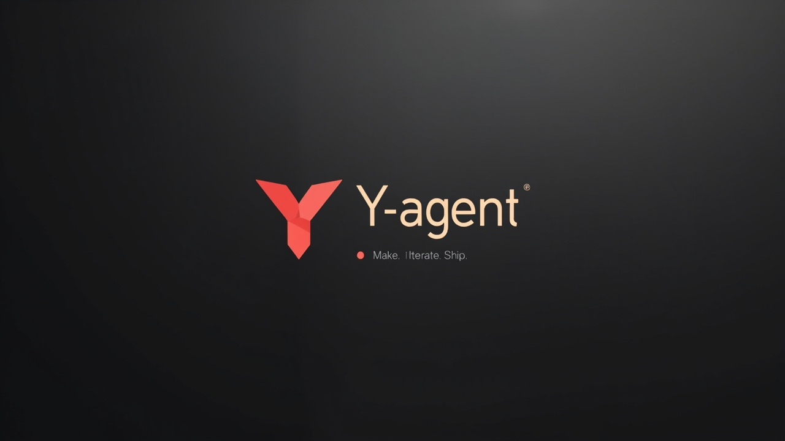

<div align="center">

# Y-agent

> **Make. Iterate. Ship.**

<p align="center">
  
</p>

游戏美术 AI 工作台 · 调即梦（豆包 Seedream）+ LLM Agent 对话
**专为独立游戏开发者打造**

<p align="center">
  <a href="https://github.com/MiniMax/Y-agent/releases"></a>
  <a href="#-快速试用"></a>
  <a href="#-文档"></a>
  
</p>

</div>

---

## 这是啥

把通用图像生成（豆包 Seedream）和 LLM Agent 对话能力，封装成**游戏美术师开箱即用的工作流**。

6 个预置 Skill（角色三视图 / 表情包 / KV 海报 / UI 图标等），输入 `/` 即选；想自由发挥就让 LLM 陪你磨 prompt 和画风。

> **一个人也能跑通「概念 → 出图 → 迭代 → 入库」**。
> 不是大团队协作工具（用 Figma），也不是通用画图工具（用 Midjourney / ComfyUI）。

---

## ✨ 核心特性

| | |
|---|---|
| 🧩 **6 预置 Skill** | 角色三视图 / 转面 / 表情包 / KV 海报 / 场景氛围 / UI 图标 |
| 💬 **Agent 对话** | LLM 主动反问、调工具、画风调优 |
| 🧠 **画风记忆** | 自动学你的偏好，下次不用再说"我要赛博朋克" |
| 📦 **本地资产库** | 每次生成自动入库，SQLite 永久保留 |
| 💸 **Demo 模式** | 不填 API Key 也能跑，看 UI 不烧钱 |
| 🔒 **本地加密** | API Key 走 AES-GCM 加密，不上传任何后端 |
| ✨ **视频 AI 增强** | 提示词自动扩成分镜 + 声音 + 配乐（H3-Context-IR） |

---

## 🚀 快速试用

### 方式 1：下载安装包（推荐普通用户）

去 [**Releases**](https://github.com/MiniMax/Y-agent/releases) 页面下 `Y-agent_*_x64-setup.exe`，双击装完即用。

### 方式 2：从源码跑（开发者）

```bash
pnpm install
.\dev-with-msvc.cmd   # Windows（注入 MSVC 工具链）
```

启动后：
1. 打开「设置」（左下角齿轮）
2. 选「试用 Demo 模式」 → 不用 Key 也能看完整 UI
3. 想真出图：填入 [火山方舟 API Key](https://console.volcengine.com/ark/region:cn-beijing/apiKey)
4. 想让 LLM 陪你反问：填「Agent LLM」配置（DeepSeek 推荐，免费）

---

## 📈 路线图

```
M0 原型 → M1 MVP → M2 v0.4（当前）→ M3 角色工坊 → M4 场景+UI → M5 图层 → M6 Skill 中心 → M7 打磨发布
 ✅        ✅          ✅                ⏳                ⏳            ⏳         ⏳                ⏳
```

---

## 📚 文档

文档在 `doc/` 目录，按需看：

- [`doc/plan.md`](./doc/plan.md) — 完整路线图 + 当前进度
- [`doc/dev.md`](./doc/dev.md) — 开发指南（命令、架构、调试）
- [`doc/api-integration-notes.md`](./doc/api-integration-notes.md) — API 接入踩坑笔记
- [`doc/即梦提示词参考.md`](./doc/即梦提示词参考.md) — 提示词最佳实践
- [`brand/BRAND.md`](./brand/BRAND.md) — 品牌规范（颜色 / 字体 / 语气）

---

## 📄 License

MIT

## 生视频模式（v0.3 新增）

- 设置面板填入视频 API Key（MiniMax H3 平台，独立于生图 Key）
- 切到「生视频」输入模式
- 输入 prompt + 选时长 / 分辨率 / 比例 → 点生成
- 视频生成中（异步，30s\~2min），资产区出现 pending 卡片
- 完成后自动入库，资产库 / 详情页可播放

详见 `doc/api-integration.md` Part 7。

## 视频提示词 AI 增强（v0.3 P9 新增）

- 视频栏自带「✨ AI 增强提示词」开关,默认开启
- 调 MiniMax 官方 H3-Context-IR API,把你写的一句话 prompt 自动扩成:
  - 镜头分镜（`[Shot 1] ... [Shot 2] ...`）
  - 声音设计（`overall_soundscape: ...`）
  - 配乐（`non_diegetic_music: ...`）
- 失败永远兜底为原 prompt（限流 / 鉴权失败 / 触发审核都不会阻塞视频生成）
- 资产详情页可对比「原文 vs AI 增强后」,方便学习「AI 给它加了啥」

详见 `doc/api-integration.md` § 7.10。
