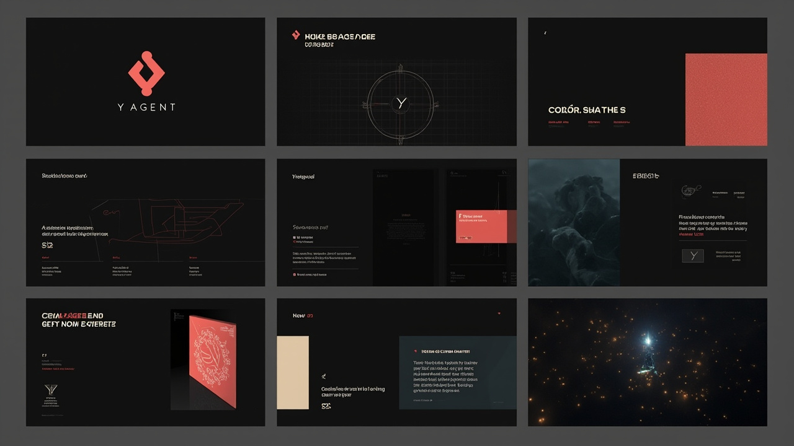
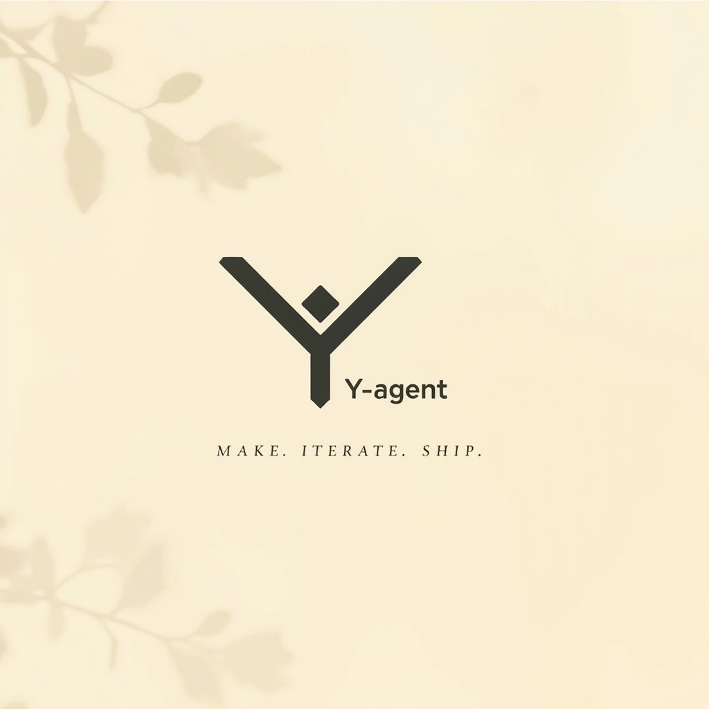

<div align="center">

# Y-agent

> **Make. Iterate. Ship.**
> 游戏美术 AI 工作台 · 调即梦（豆包 Seedream）+ LLM Agent

<p align="center">
  
</p>

<p align="center">
  <a href="https://github.com/MiniMax/Y-agent/releases"></a>
  <a href="#快速试用"></a>
  <a href="#license"></a>
  
</p>

<p align="center">
  <a href="#-这是啥">是什么</a> · <a href="#-核心特性">特性</a> · <a href="#-快速试用">试用</a> · <a href="#-品牌">品牌</a> · <a href="#-路线图">路线图</a>
</p>

</div>

---

## 这是啥

**Y-agent** 是一个面向**独立游戏开发者**的桌面 AI 工具，把通用图像生成（豆包 Seedream）和 LLM Agent 对话能力，封装成**游戏美术师开箱即用的工作流**。

- 🎯 **不是**通用 AI 画图工具（Midjourney / ComfyUI 那种）
- 🎯 **不是**企业级团队协作 SaaS（Figma / MiniMax Design 那种）
- ✅ **是**给一个人或小团队用的「美术工作台」——预置 6 个游戏美术 Skill、规则路由、对话模式、自带资产管理

核心想法：**让一个人也能跑通「概念 → 出图 → 迭代 → 入库」**。

---

## 📸 应用截图

<p align="center">
  
</p>

> 三栏布局：左侧导航（项目库 / 资产中心 / Skill）/ 中央创作区（对话 + 资产网格 tab）/ 右侧详情。
> 截图待补；想看实机效果：[**下载安装包**](https://github.com/MiniMax/Y-agent/releases) 跑一遍 `.\dev-with-msvc.cmd`。

---

## ✨ 核心特性

| 特性 | 说明 |
|---|---|
| 🧩 **6 预置 Skill** | 角色三视图 / 角色转面 / 表情包 / KV 海报 / 场景氛围 / UI 图标 —— 输入框打 `/` 即选 |
| 💬 **Agent 对话模式** | LLM 主动反问、调工具、画风调优，比「写 prompt → 等 → 失望」快 3 倍 |
| 🧠 **项目级 Agent Memory** | 自动学习你的画风偏好，下次不用重复说"我要赛博朋克" |
| 📦 **本地资产库** | 每次生成自动入 SQLite，资产网格永久保留；可按项目分组 |
| 🎨 **4 套主题** | 暗夜（炭灰 + 珊瑚红）/ 晨光（米白）/ 赛博 / 森林，护眼 + 截图分享都好用 |
| 💸 **Demo 模式** | 不填 API Key 也能看 UI 和工作流，烧钱之前先搞清楚再上手 |
| 🔒 **本地加密** | API Key 走 AES-GCM 加密存 Rust 端，**不会上传任何后端** |
| ⚡ **Tauri 2 桌面应用** | 打包后 ~3 MB，启动 < 1s，比 Electron 轻 10 倍 |

---

## 🎁 6 个预置 Skill

| Skill | 适用场景 | 提示词模板 |
|---|---|---|
| `character-sheet` | 角色概念设计 | 角色三视图、表情、配色统一 |
| `character-turnaround` | 角色建模前转面图 | 360° 角色转身四视图 |
| `expression-grid` | 角色表情包 | 9 宫格表情矩阵（喜怒哀乐等） |
| `kv-poster` | 游戏 KV 海报 | 主视觉、人物站位、构图引导 |
| `scene-mood` | 场景氛围图 | 关键场景、光照、气氛板 |
| `ui-icons` | UI 图标 | 一致风格的图标集 |

每个 Skill 都有精心调过的提示词模板，**你只需要在 LLM 对话里说想要什么**（"帮我画个赛博朋克女刺客三视图"），Agent 会自动调对应 Skill。

---

## 🔀 3 种工作模式

| 模式 | 行为 | 何时用 |
|---|---|---|
| **生图** | 直接调即梦 API，资产入库 | 知道想要什么、要快 |
| **对话（无 LLM Key）** | 规则路由 → 展示计划 → 点确认才生图 | 没 LLM Key 也能体验 |
| **对话（有 LLM Key）** | LLM 主动反问 / 调工具 / 反复迭代 | 想要 AI 陪你磨 prompt、画风调优 |

模式间可随时切换，**资产网格永远在另一个 tab 等你**。

---

## 🤖 模型支持

### 图像生成（火山方舟即梦 / Doubao Seedream）

| 模型 | Model ID | 图层拆分 | 组图 | 备注 |
|---|---|---|---|---|
| Seedream 5.0 Lite | `doubao-seedream-5-0-lite-260128` | ❌ | ✅ | **默认**，多数账号已开通 |
| Seedream 4.5 | `doubao-seedream-4-5-251128` | ❌ | ✅ | |
| Seedream 4.0 | `doubao-seedream-4-0-250828` | ❌ | ✅ | |
| Seedream 5.0 Pro | `doubao-seedream-5-0-pro-260628` | ✅ | ❌ | **需手动开通**，M2 重点 |
| 自定义 | (Endpoint ID) | — | — | 选「自定义 ID…」填入 |

> ⚠️ 首次接入真实 API 必读 [`doc/api-integration-notes.md`](./doc/api-integration-notes.md) —— 5 个常见坑的解决方案。

### Agent LLM（用于对话模式）

| Provider | 默认模型 | Endpoint |
|---|---|---|
| **DeepSeek**（推荐） | `deepseek-v4-flash` | `https://api.deepseek.com/v1/chat/completions` |
| **豆包 Lite**（火山方舟） | `doubao-lite-32k` | `https://ark.cn-beijing.volces.com/api/v3/chat/completions` |
| **OpenAI** | `gpt-4o-mini` | `https://api.openai.com/v1/chat/completions` |
| **自定义** | 任意 OpenAI 兼容端点 | 自己填 |

> 💡 **降级**：不填 LLM Key → 对话模式自动回落到「规则路由 + 计划确认」（不自动生图）。

---

## 🚀 快速试用

### 方式 1：下载安装包（推荐普通用户）

1. 前往 [**Releases**](https://github.com/MiniMax/Y-agent/releases) 下载 `Y-agent_x.y.z_x64-setup.exe`
2. 双击安装（约 3 MB）
3. 启动 → 打开「设置」→ 选「试用 Demo 模式」 → 在「开始创作」输入 prompt

### 方式 2：从源码跑（开发者）

```bash
# 1. 装依赖
pnpm install

# 2. 启动开发模式（应用 + 热重载，Windows）
.\dev-with-msvc.cmd
# 或 PowerShell 直接调:
# & "E:\Pi\Y-agent\dev-with-msvc.cmd"
```

启动后：
1. 打开「设置」面板（左下角齿轮）
2. 选「试用 Demo 模式」—— 不用 Key 也能看 UI
3. 或填入 [火山方舟 API Key](https://console.volcengine.com/ark/region:cn-beijing/apiKey)
4. （可选）填「Agent LLM」配置 —— 想用真对话模式必填
5. 在「开始创作」输入 prompt → 选模型（默认 5.0 Lite）→ 生成
6. 想用对话模式：在输入框点 **/ 选 Skill**，或直接说需求

### 方式 3：打自己的安装包

```bash
.\build-installer.cmd   # 用 MSVC 工具链打 NSIS installer
# 产物在 src-tauri\target\release\bundle\nsis\
```

---

## 🎨 品牌

Y-agent 走的是**「暗色桌面应用 + 单一高饱和暖色强调」**路线 —— 用珊瑚红 `#FF5C4D` 区别于所有「AI 蓝紫」竞品，传递「创作之火」而非「科技感」。

<p align="center">
  
</p>

<p align="center">
  
  &nbsp;&nbsp;&nbsp;&nbsp;
  
  &nbsp;&nbsp;&nbsp;&nbsp;
  
</p>

| 项目 | 值 |
|---|---|
| **主色** | Coral `#FF5C4D` |
| **暗背景** | Charcoal `#0E0F13` |
| **亮背景** | Cream `#F2EBDB` |
| **成功** | Teal `#5BC2A8` |
| **Tagline** | **Make. Iterate. Ship.** |
| **核心隐喻** | Y 字 = 创作分叉路口；分叉点 spark 节点 = AI 触发点 |

完整规范（颜色 token / 字体 / UI 应用 / 出活清单）见 [`brand/BRAND.md`](./brand/BRAND.md)。

---

## 📈 路线图

```
M0 原型验证     ✅ 2026-08-19
M1 MVP          ✅ 2026-08-19
M2 v0.1         ✅ 2026-08-19
M2 v0.2         ✅ 2026-08-19   (Skill + 规则路由)
M2 v0.3         ✅ 2026-08-19   (LLM 真对话)
M2 v0.4         ✅ 2026-08-19   (Agent Memory + 历史持久化)
                                ↓
M3 角色工坊       ⏳ 待启动       (角色一致性 / 多角度 / 拆分图层)
M4 场景+UI       ⏳              (场景生成 + UI 图标库)
M5 图层         ⏳              (Seedream 5.0 Pro 图层深度集成)
M6 Skill 中心    ⏳              (Skill 社区 / 第三方贡献)
M7 打磨发布      ⏳              (macOS / Linux / Auto-update)
```

每个里程碑详细任务见 [`doc/plan.md`](./doc/plan.md)。

---

## 🛠️ 技术栈

- **桌面壳**：Tauri 2
- **前端**：React 18 + TypeScript + Vite 5 + Tailwind 3
- **后端**：Rust（reqwest + rusqlite + aes-gcm）
- **存储**：SQLite（bundled）+ 文件系统
- **图像 API**：火山方舟即梦（Seedream 4.0 / 4.5 / 5.0 lite / pro）
- **LLM API**：DeepSeek / 豆包 / OpenAI / 自定义 OpenAI 兼容端点
- **前端 Markdown**：`react-markdown` + `remark-gfm`

### 目录结构

```
E:\Pi\Y-agent\
├── brand/               # 🎨 品牌资产 + BRAND.md
├── doc/                 # 📚 文档
├── src/                 # 前端 (React + TS)
│   ├── components/      # UI 组件
│   ├── lib/             # API 客户端、Agent 引擎、工具
│   └── skills/builtin/  # 6 个预置 Skill 模板
├── src-tauri/           # Rust 后端
├── public/              # 静态资源 (logo.svg / icon.svg)
├── build-installer.cmd  # 打 NSIS 安装包
├── dev-with-msvc.cmd    # 开发模式启动
├── package.json
└── vite.config.ts
```

---

## 🧑‍💻 开发

```bash
pnpm dev          # Vite 仅前端（端口 1420）
pnpm build        # tsc -b && vite build
pnpm lint         # ESLint，--max-warnings 0
pnpm test         # Vitest 单测
pnpm tauri        # Tauri CLI

# Windows 必须用包装脚本注入 MSVC 工具链
.\dev-with-msvc.cmd     # 完整 dev（Tauri + Vite）
.\build-installer.cmd   # 打安装包
```

完整开发指南： [`doc/dev.md`](./doc/dev.md)

---

## 📚 文档

- [`doc/plan.md`](./doc/plan.md) — 14-18 周完整路线图 + 当前进度
- [`doc/dev.md`](./doc/dev.md) — 开发指南（命令、目录、架构、调试）
- [`doc/api-integration-notes.md`](./doc/api-integration-notes.md) — API 集成踩坑笔记
- [`doc/即梦api.md`](./doc/即梦api.md) — 即梦 API 原始文档
- [`doc/即梦提示词参考.md`](./doc/即梦提示词参考.md) — 提示词最佳实践
- [`brand/BRAND.md`](./brand/BRAND.md) — 完整品牌规范

---

## 🤝 适合谁

- 🎮 **独立游戏开发者** —— 一个人扛起美术，想要「自助式」AI 工具
- 🧑‍🎨 **小团队美术** —— 2-3 人，没有专职美术总监，要靠预置 Skill 保持风格统一
- 🧪 **AI 工具尝鲜者** —— 想要一个能「直接装、立即用、不用配一堆」的桌面端 AI 画图

**不适合**：
- ❌ 大型团队 / 公司美术（需要协作、review、权限管理 —— 用 Figma / MiniMax Design）
- ❌ 通用 AI 画图（什么都能画、什么都画不好 —— 用 Midjourney / ComfyUI）
- ❌ 商业级出图（要 16K 印刷、矢量、CMYK —— 用 Adobe 全家桶）

---

## 📄 License

MIT
